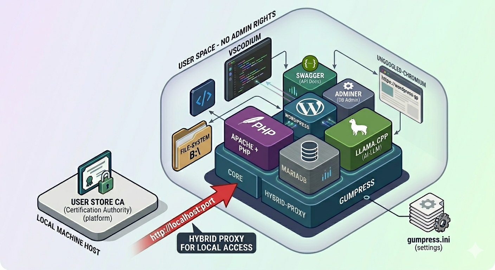
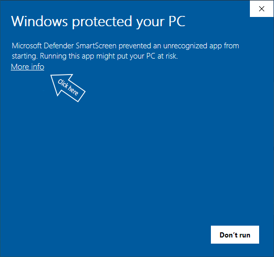
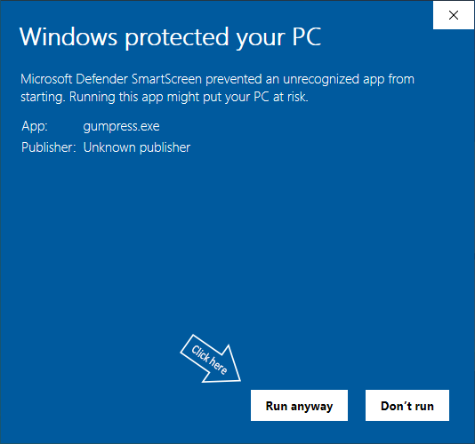
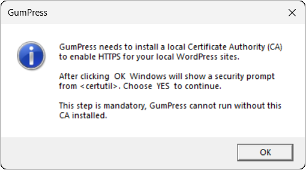
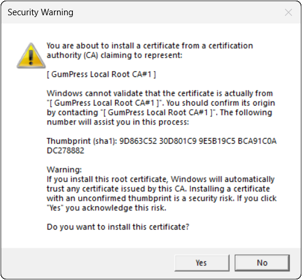

# GumPress

GumPress is a **free Open-Core** WordPress offline stack for Windows.
No install. No Docker. No admin rights. No internet required.
Just unzip and start. Whenever you want: tinker, customize, rezip, and redistribute your own version, freely.

<br>
<p align="center">
	
	<br>
	<!--<em>GumPress Overview</em>-->
</p>

## Learn More

- **[Vision & Goals](docs/vision_goals.md)** – _(drafting)_ Why we built GumPress and who it is designed for.
- **[Core Concepts](docs/core_concepts.md)** – _(drafting)_ Discover the free Open-Core model, clonability, portability, and how to customize your own stack.
- **[Stack & Security](docs/stack_security.md)** – _(drafting)_ Included components, privacy commitments, and software integrity.

🚧 The documentation is currently being finalized. Sections marked as _drafting_ are being populated.

## Get Started

1. [**Download the latest release**](https://github.com/gumpress/gumpress/releases/latest) and extract it to a folder of your choice.
2. Launch **`gumpress.exe`** to start the environment.
3. Say "Wow!" 🤯 You're now ready to tinker.
4. Check the [**Changelog**](docs/changelog.md) to see what's new in this release.

> [!TIP]
> ❤️ **Finding GumPress useful?** Consider [supporting this project](docs/support.md).

## Integrity

GumPress prioritizes transparency. You can verify the core executable's integrity by comparing its **SHA&#8209;256 Hash** with the one
calculated on your local file using PowerShell `Get-FileHash gumpress.exe -Algorithm SHA256`.

<table>
  <tr>
	 <td><b>File</b></td>
	 <td><code>gumpress.exe</code></td>
	 <td><b>Hash</b></td>
	 <td><code><!--HASH-->25e5105431e9d5e5fec7d04a01f2cdfdedef839e01fdb0e72f7f10393076b9fe<!--HASH--></code></td>
  </tr>
</table>

## Security

> [!IMPORTANT]
> Windows might display SmartScreen and/or CA Security warnings during the **first run**.
> This is normal for unsigned independent software and expected when installing a custom local CA.
> Your action _is required only once and does NOT require administrator rights_.

<details>
	<summary><b>💡 If this happens, click here to view the steps to proceed</b></summary>
	<br>

|| Action A | Action B |
| :---: | :---: | :---: |
| **1.&nbsp;SmartScreen** | <br>*Click **More info*** | <br>*Click **Run anyway*** |
| **2.&nbsp;CA&nbsp;Security** | <br>*Click **OK*** | <br>*Click **Yes*** |

</details>

## Telemetry & Privacy

Due to our free redistribution policy, we cannot track adoption without a minimal heartbeat. We are committed to transparency and respect for user privacy.

* **What we collect**: Only an anonymous ID (GUID) and the version number (VERS).
* **Privacy First**: We do NOT collect personal info, hardware identifiers, or any data from your machine, user profile, or local projects.
* **Full Control**: The anonymous ID is not linked to your identity, and you can reset it at any time.

📜 For a detailed technical breakdown, see the full [**policies.txt**](./policies.txt) file.

## Project Structure

This is how the GumPress environment is organized after extraction:

```text
conf/                   ← Configuration files
  llama-cpp/            ← Models and related files
core/                   ← Components
docs/                   ← Documentation
root/                   ← Your main environment container
  wordpress/            ← Your local WordPress project
    .git/               ← Local repository metadata
    mailer_data/        ← Captured local emails
    public_html/        ← A clean WordPress installation
    stored_data/        ← Persistent data for WordPress
    tryout_code/        ← Scripts runnable in WordPress context via VSCodium
user/                   ← User data and temporary files           
gumpress.exe            ← The main launcher
gumpress.ini            ← The main configuration file
```

## License

GumPress is distributed under GumPress Software License 1.0 and is free to use, configure, and distribute; see the full [**licenses.txt**](./licenses.txt) file for details on third-party components.
<br>
If you find this project useful [consider supporting](docs/support.md) its development.

---
*Built with passion for the WordPress community.*