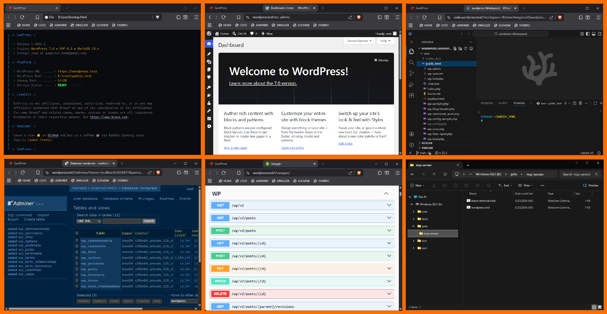
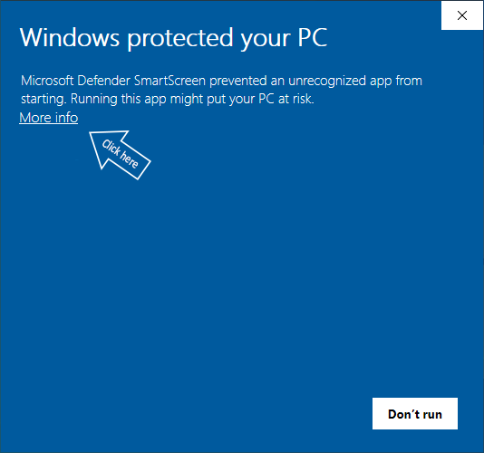
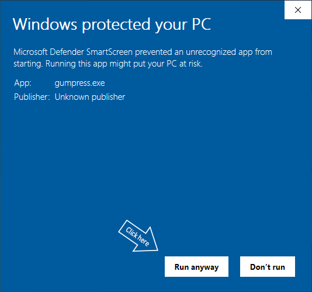

# GumPress

WordPress that just run in one click: zero install, zero admin, secure — clone to snapshot anytime and tinker freely.
 
Designed natively for Windows.

## Get Started

1. [Download the latest release](https://github.com/gumpress/gumpress/releases/latest) and extract it to a folder of your choice
2. Launch the orchestrator (`gumpress.exe`) to start the environment
3. Say "Wow!" 🤯 You're now ready to tinker
4. Check the [releases](https://github.com/gumpress/gumpress/releases) page for the full changelog

> [!TIP]
> 📧 **Questions?** Contact us at [gumpress.team@gmail.com](mailto:gumpress.team@gmail.com) 
> ❤️ **Finding&nbsp;GumPress&nbsp;useful&nbsp;?**&nbsp;Consider&nbsp;[supporting&nbsp;this&nbsp;project](docs/support.md)

## Learn More

GumPress is a local WordPress offline stack for Windows.
No install. No Docker. No admin rights. No internet required.
Just unzip and start. Whenever you want: tinker, customize, rezip, and redistribute your own version, freely.

 

	
	  
	<a href="https://gumpress.github.io/" target="_blank">Watch Overview Video</a>

 

- **[Vision & Goals](docs/vision_goals.md)** – _(drafting)_ Why we built GumPress and who it is designed for
- **[Core Concepts](docs/core_concepts.md)** – _(drafting)_ Discover the free Open-Core model, clonability, portability, and how to customize your own stack
- **[Stack & Security](docs/stack_security.md)** – _(drafting)_ Included components, privacy commitments, and software integrity

🚧 The documentation is currently being finalized. Sections marked as _drafting_ are being populated.

## Integrity & Security

GumPress prioritizes transparency. You can verify the orchestrator (`gumpress.exe`) integrity by comparing its **SHA&#8209;256 Hash** with the one
calculated on your local file using PowerShell `Get-FileHash gumpress.exe -Algorithm SHA256`; moreover you can check its security
status online via **MetaDefender**.

<table>
  <tr>
	 <td><b>File</b></td>
	 <td><code>gumpress.exe</code></td>
  </tr>
  <tr>
	 <td><b>SHA-256 Hash</b></td>
	 <td><code><!--HASH1-->74963882a5bf88049ac8f495bdc44b806bdf6324d3a6eae979c7c741f81638a5<!--HASH1--></code></td>
  </tr>
  <tr>
	 <td><b>MetaDefender</b></td>
	 <td><!--HASH2--><a href="https://metadefender.com/results/hash/74963882a5bf88049ac8f495bdc44b806bdf6324d3a6eae979c7c741f81638a5"><!--HASH2-->Check Security Status Online</a></td>
  </tr>
</table>

## Notice

> [!IMPORTANT]
> Windows might display **SmartScreen** warnings during the **first run**.
> This is normal for unsigned independent software.
> Your action _is required only once and does NOT require administrator rights_.

 

	
<b>💡 If this happens, click here to view the steps to proceed</b>

	 

| Action A | Action B |
| :---: | :---: |
|  *Click **More info*** |  *Click **Run anyway*** |

> [!CAUTION]
> If you have **Smart App Control** enabled on **Windows 11**, it may block the application without providing a "Run anyway" option. This occurs because the feature automatically blocks files that are **unsigned or have low reputation**. To use GumPress, you may need to disable this feature in *Windows Security > App & browser control*.

## License

GumPress is a software bundle that combines a proprietary management engine (**Orchestrator**) with several independent open-source components (**Third-Party**).

### 1. Orchestrator

The orchestrator (`gumpress.exe`) is licensed under the **GumPress Software License 1.0**.
* **Usage**: Free to use, configure, and distribute for personal or commercial development.
* **Main Restrictions**: Standalone resale and reverse engineering are prohibited. It is not designed for production environments.
* **Full Terms**: See the [**license**](./license.md) file.

### 2. Third-Party

The third-party components are separate works governed by their own original open-source licenses. Orchestrator license does not modify or restrict your rights under those terms.
For details about versions, licenses, and applied changes, refer to the technical manifests:

<table>
	<tr>
		<td><b>WordPress</b></td>
		<td><a href="root/@manifest.json">root/@manifest.json</a></td>
	</tr>
	<tr>
		<td><b>Apache</b></td>
		<td><a href="core/apache/@manifest.json">core/apache/@manifest.json</a></td>
	</tr>
	<tr>
		<td><b>PHP</b></td>
		<td><a href="core/php/@manifest.json">core/php/@manifest.json</a></td>
	</tr>
	<tr>
		<td><b>MariaDB</b></td>
		<td><a href="core/mariadb/@manifest.json">core/mariadb/@manifest.json</a></td>
	</tr>
	<tr>
		<td><b>Brave</b></td>
		<td><a href="core/brave/@manifest.json">core/brave/@manifest.json</a></td>
	</tr>
	<tr>
		<td><b>VSCodium</b></td>
		<td><a href="core/vscodium/@manifest.json">core/vscodium/@manifest.json</a></td>
	</tr>
	<tr>
		<td><b>Git</b></td>
		<td><a href="core/git/@manifest.json">core/git/@manifest.json</a></td>
	</tr>
	<tr>
		<td><b>Nodejs</b></td>
		<td><a href="core/nodejs/@manifest.json">core/nodejs/@manifest.json</a></td>
	</tr>
	<tr>
		<td><b>MCP Adapter</b></td>
		<td><a href="core/mcp-adapter/@manifest.json">core/mcp-adapter/@manifest.json</a></td>
	</tr>
	<tr>
		<td><b>System</b></td>
		<td><a href="core/system/@manifest.json">core/system/@manifest.json</a></td>
	</tr>
</table>

---

*Built with passion for the WordPress community.*
